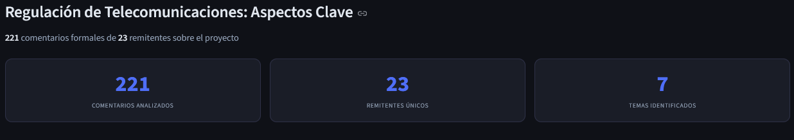
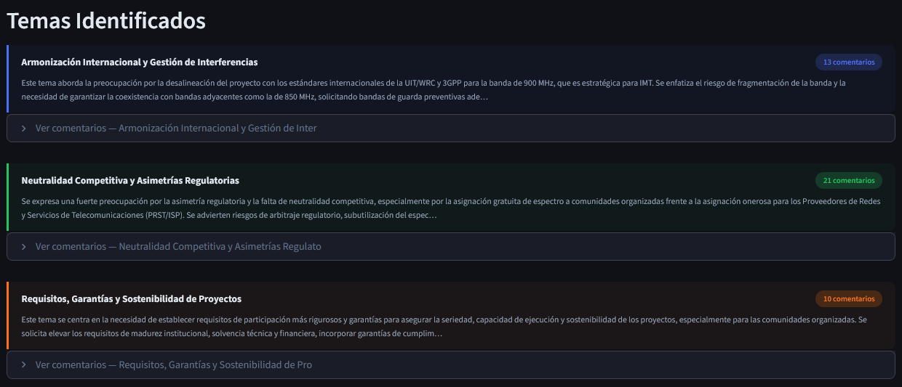

# 📊 Herramienta de Análisis de Comentarios — ANE

> Plataforma de análisis automático de comentarios de consultas públicas, impulsada por IA generativa (Gemini 2.5 Flash) y construida con Streamlit.

<div align="center">
  <video src="assets/demo.mp4" width="100%" autoplay loop muted></video>
  </video>
</div>
---

## ¿Qué hace?

Convierte un archivo Excel de comentarios de consulta pública en un informe ejecutivo completo en minutos:

- **Identificación de temas** — agrupa automáticamente los comentarios en 6–8 temas principales mediante LLM
- **Análisis de posturas** — clasifica cada comentario en: `Soporte`, `Rechazo / Objeción`, `Propuesta de ajuste` o `Técnico / Neutro`
- **Visualizaciones interactivas** — 6 gráficas fijas (donut de posturas, barras por tema, box plot de profundidad, heatmap, entre otras)
- **Informe Word (DOCX)** — genera automáticamente un reporte ejecutivo con fuente Arial, títulos en negro y gráficas legibles sobre fondo blanco
- **Agnóstica al dominio** — funciona para cualquier tipo de consulta pública, no solo telecomunicaciones

---

## Demo

| KPIs y panorama general | Tarjetas de temas con posturas |
|---|---|
|  |  |

> Reemplaza las imágenes anteriores con capturas reales de cada sección si lo deseas.

---

## Estructura del repositorio

```
.
├── .streamlit/
│   └── config.toml          # Tema visual oscuro de Streamlit
├── app/
│   └── main.py              # Aplicación principal
├── assets/
│   └── demo.mp4             # Demostracion del proyecto
│   └── imgs.png             
├── data/
│   └── raw/
│       └── .gitkeep         # Carpeta para el Excel de entrada (no se versiona)
├── .env.example             # Plantilla de variables de entorno
├── .gitignore
├── README.md
└── requirements.txt
```

---

## Requisitos previos

- Python 3.11 o superior
- Una API Key de [Google AI Studio](https://aistudio.google.com/app/apikey) (Gemini)
- El archivo Excel debe tener al menos estas columnas: `No.`, `Remitente`, `Observación recibida`

---

## Instalación

```bash
# 1. Clonar el repositorio
git clone https://github.com/drambaut/Herramienta-de-an-lisis-de-Comentarios---ANE-.git
cd herramienta-analisis-comentarios

# 2. Crear y activar entorno virtual
python -m venv venv

# Windows
venv\Scripts\activate
# macOS / Linux
source venv/bin/activate

# 3. Instalar dependencias
pip install -r requirements.txt

# 4. Configurar variables de entorno
cp .env.example .env
# Editar .env y pegar tu GEMINI_API_KEY
```

---

## Configuración

Edita el archivo `.env` en la raíz del proyecto:

```env
GEMINI_API_KEY=tu_api_key_aqui
```


---

## Uso

```bash
streamlit run app/main.py
```

La aplicación abre automáticamente en `http://localhost:8501`.

### Flujo de uso

1. (Opcional) Escribe el nombre del proyecto en el campo de texto
2. Sube el archivo Excel con los comentarios
3. Espera ~60–90 segundos mientras la IA procesa
4. Explora los KPIs, tarjetas de temas, gráficas y tabla de remitentes
5. Descarga el informe ejecutivo en formato DOCX

---

## Formato del Excel esperado

El archivo debe tener los encabezados en la **fila 24** (formato estándar ANE) o en las primeras filas. La herramienta detecta el formato automáticamente.

| Columna | Descripción |
|---|---|
| `No.` | Número identificador del comentario |
| `Remitente` | Nombre de la entidad o persona que comenta |
| `Observación recibida` | Texto completo del comentario |

---

## Dependencias principales

| Paquete | Versión | Uso |
|---|---|---|
| `streamlit` | ≥ 1.32 | Interfaz web |
| `google-genai` | ≥ 1.0 | Cliente Gemini API |
| `plotly` | ≥ 5.18 | Visualizaciones interactivas |
| `python-docx` | ≥ 1.1 | Generación del informe Word |
| `kaleido` | 0.2.1 | Exportación de gráficas a PNG |
| `pandas` | ≥ 2.0 | Procesamiento de datos |
| `openpyxl` | ≥ 3.1 | Lectura de archivos Excel |

---

## Arquitectura de procesamiento IA

```
Excel subido
     │
     ▼
Prompt 1 — Identificación de temas (6–8 temas, temperature=0.1)
     │
     ▼
Prompt 2 — Decisión de gráficas analíticas (para el DOCX)
     │
     ▼
Prompt 3 — Clasificación de posturas por comentario
     │
     ▼
Prompt 4 — Extracción del nombre del proyecto (12 palabras)
     │
     ▼
Gráficas fijas (deterministas, sin IA)
     │
     ▼
Generación DOCX + UI interactiva
```

> Los Prompts 1–3 usan `temperature=0.1` para resultados reproducibles entre ejecuciones.

---

## Limitaciones conocidas

- El análisis toma los primeros 100 comentarios para la identificación de temas (límite configurable en `procesar_con_ia`)
- Se requiere conexión a internet para llamar a la API de Gemini
- La exportación de gráficas a PNG requiere que `kaleido==0.2.1` esté instalado correctamente

---

## Desarrollado por

Dirección de Regulación — **Agencia Nacional del Espectro (ANE)**  
Colombia · 2026
